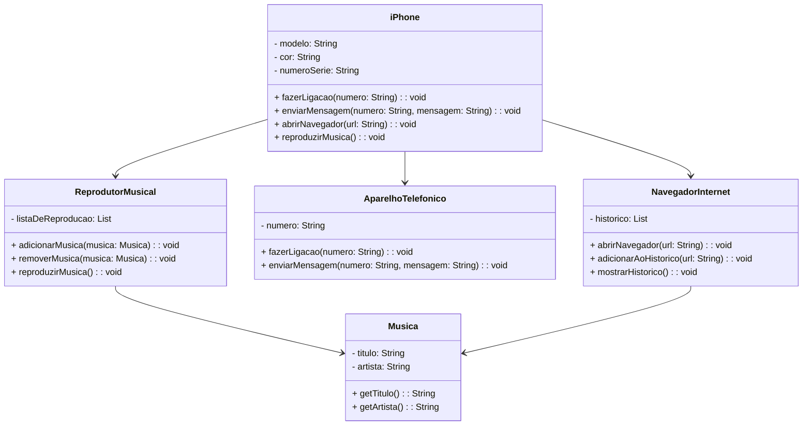

# Desafio Diagramação de Classes do iPhone

Este é um projeto Java que demonstra as funcionalidades de um iPhone, incluindo Reprodutor Musical, Aparelho Telefônico e Navegador na Internet.

## O que Aprendemos

Este projeto de exemplo foi uma oportunidade para aprender e praticar conceitos de programação orientada a objetos em Java, incluindo:

1. **Classes e Objetos:** Aprendemos a criar classes e objetos para modelar entidades do mundo real, como o iPhone, o Reprodutor Musical e o Navegador na Internet.

2. **Encapsulamento:** Entendemos a importância de encapsular os atributos de classe e fornecer métodos públicos para interagir com esses atributos, seguindo as melhores práticas de encapsulamento.

3. **Herança e Polimorfismo:** Implementamos herança para compartilhar comportamento comum entre as classes do iPhone e as classes de funcionalidades específicas (Reprodutor Musical, Aparelho Telefônico, Navegador na Internet). Também aplicamos polimorfismo ao criar métodos comuns que podem ser substituídos em subclasses para implementar comportamentos específicos.

4. **Coleções e Listas:** Usamos Listas (por exemplo, List) para armazenar objetos, como músicas em um reprodutor musical e URLs no histórico de navegação.

5. **Getters e Setters:** Implementamos métodos getters e setters para acessar e modificar os atributos privados das classes.

6. **Organização de Projetos:** Organizamos o projeto em pacotes e diretórios para facilitar a manutenção e compreensão do código.

7. **Uso do Git e Controle de Versão:** Aprendemos a usar o Git para rastrear as mudanças em nosso projeto e colaborar com outros desenvolvedores.

## Diagrama de Classes

