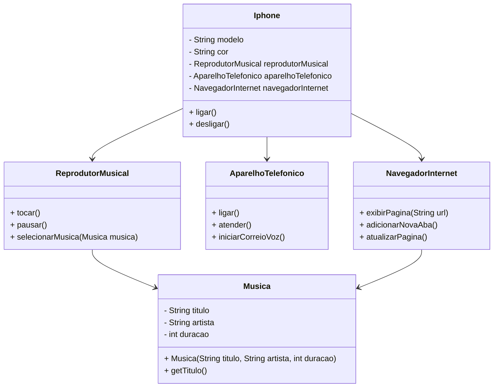

# Desafio Diagramação de Classes do iPhone

Este projeto representa a modelagem e a implementação básica do componente iPhone, que inclui funcionalidades de Reprodutor Musical, Aparelho Telefônico e Navegador na Internet. 

## Diagrama de Classes

